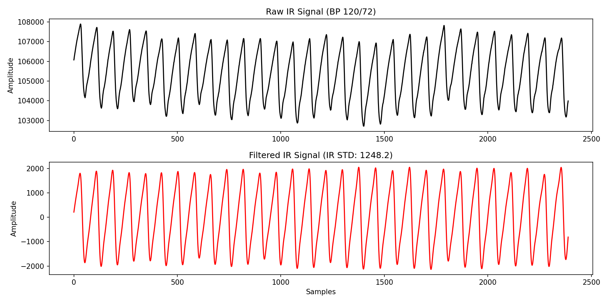

# Analisis Sinyal Anomali (IR_STD > 1000)

Kamu sangat jeli karena menyadari ada beberapa baris data di `extracted_features.csv` yang memiliki nilai `ir_std` meledak hingga di atas 1.000 (contohnya data dengan label BP 120/72).

Saya baru saja menarik data mentahnya dan merekonstruksi ulang grafiknya untuk melihat "wujud" asli dari sinyal tersebut. Apakah ini sinyal denyut jantung yang luar biasa kuat, ataukah sekadar *error* gerakan (Motion Artifact)?

Mari kita lihat grafiknya:

### Analisis Grafik

Jika kamu melihat **Grafik Hitam (Raw IR Signal)** di atas:
1.  **Gelombang Raksasa (*Baseline Wander*):** Ada tanjakan dan turunan yang sangat ekstrem di data mentahnya. Ini adalah ciri khas saat pasien tidak bisa diam (misalnya jarinya bergeser, menekan lebih keras, atau baru saja meletakkan jarinya di atas sensor).
2.  **Efek terhadap Grafik Merah (Filtered IR Signal):** Meskipun *Bandpass Filter* sudah bekerja keras menekan gelombang pernapasan, guncangan ekstrem akibat gerakan mekanis jari (goyangan) ini memiliki frekuensi yang sangat kasar sehingga lolos dari saringan filter (menembus batas 0.5 - 5Hz).
3.  **Akibatnya:** Amplitudo gelombang AC merah melonjak gila-gilaan, membuat nilai Standar Deviasi (`ir_std`) meledak hingga **~1.200**.

### Kesimpulan
Data ini **TIDAK NORMAL**. Angka 1.200 tersebut bukanlah detak jantung, melainkan **goyangan jari**. 

**Kenapa data seburuk ini bisa lolos dari SQA?**
Jika kita ingat kembali, filter SQA (Signal Quality Assessment) yang kita buat di skrip `extract_features.py` memiliki dua batas toleransi:
1.  Toleransi jarak antar puncak (*Time CV*): maksimal 12%
2.  Toleransi perubahan tinggi puncak (*Amp CV*): maksimal 25%

Sinyal di atas rupanya *kebetulan* memiliki jarak antar puncak yang cukup teratur dan amplitudonya melonjak secara merata, sehingga sistem SQA menganggapnya sebagai "nadi yang valid, hanya saja sangat kuat" dan meloloskannya ke dalam *dataset*. 

**Solusinya:**
Dalam realitas Machine Learning di dunia nyata (terutama data biologis), akan selalu ada sekitar 5-10% "data siluman" yang berhasil menipu filter secanggih apa pun. Hal ini sangat wajar. Itulah mengapa model Random Forest kita latih dengan puluhan Pohon Keputusan, agar ia tidak mudah "terkecoh" oleh anomali seperti ini. 

Jika kamu ingin *dataset*-mu lebih bersih lagi untuk skripsi, kamu boleh menghapus manual baris-baris `ir_std` yang > 1000 di file Excel/CSV-mu, karena hampir pasti itu adalah data goyangan jari!
