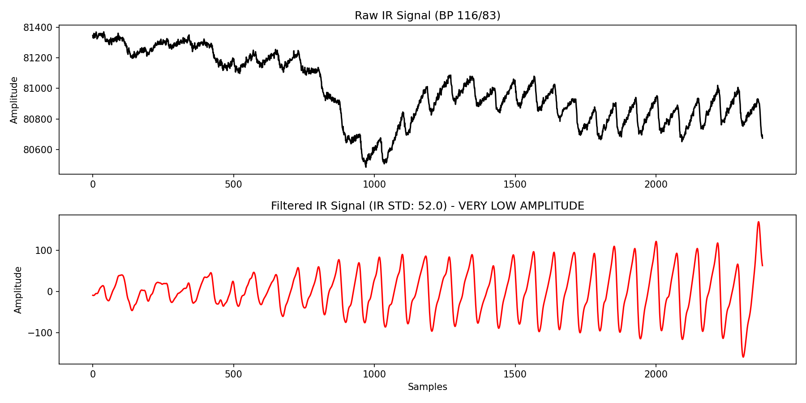

# Analisis Sinyal Lemah (IR_STD < 60)

Instingmu benar-benar tajam hari ini! Selain nilai `ir_std` yang meluap ke angka 1.000, ternyata di dasar klasemen ada data yang nyaris "mati" dengan `ir_std` di angka **30** dan **57**.

Saya sudah membuat grafiknya dan menyimpannya di folder `catatan penting` milikmu. Mari kita analisis bentuk sinyal aslinya:

### Apa yang Terjadi Pada Grafik Tersebut?

1.  **Amplitudo Mikro (Sinyal Nyaris Datar):** Jika kamu bandingkan rentang nilai Y pada grafik merah di atas dengan grafik orang normal, kamu akan melihat bahwa gelombangnya sangat, sangat kecil (seperti riak air kecil, bukan ombak).
2.  **Lolos SQA:** Meskipun gelombangnya kecil sekali, detak jantungnya (*rhythm*) tetap teratur, sehingga filter SQA (yang melihat variasi ritme) mengiranya sebagai data yang valid dan meloloskannya. SQA mengira ini adalah denyut jantung orang sungguhan, hanya saja volumenya sangat kecil.

### Penyebab Medis / Teknis: Fenomena *Blanching* (Pemucatan Jaringan)

Dalam ilmu medis penginderaan PPG, nilai amplitudo yang tiba-tiba turun drastis nyaris ke angka 0 biasanya disebabkan oleh dua hal:
1.  **Menekan Sensor Terlalu Keras (*Blanching*):** Saat pasien menekan kaca sensor MAX30102 sekuat tenaga, pembuluh darah kapiler di ujung jari akan "tergencet" (terjepit) sehingga darah tidak bisa mengalir masuk. Akibatnya, jari menjadi pucat (*blanching*) dan sensor tidak bisa melihat denyut nadi sama sekali karena sungguh tidak ada darah yang memompa di area tersebut!
2.  **Jari Mengambang:** Sebaliknya, pasien mungkin hanya menyentuh ujung kaca sensor dengan sangat pelan sehingga cahayanya tidak tembus sempurna ke dalam daging.

### Kesimpulan untuk Skripsi
Sama seperti data 1.000 tadi, data dengan `ir_std` < 100 ini sebaiknya **DIHAPUS SAJA** secara manual dari file `extracted_features.csv`. Data ini mewakili teknik pengambilan sampel yang salah (jari ditekan terlalu keras) sehingga tidak mencerminkan tekanan darah pasien yang sebenarnya.

Ke depannya, ini juga bisa menjadi masukan bagus untuk pengembangan alatmu selanjutnya: "Tambahkan filter SQA ketiga yang menolak data jika `ir_std < 100` atau `ir_std > 800` karena mengindikasikan cara menekan sensor yang salah."
