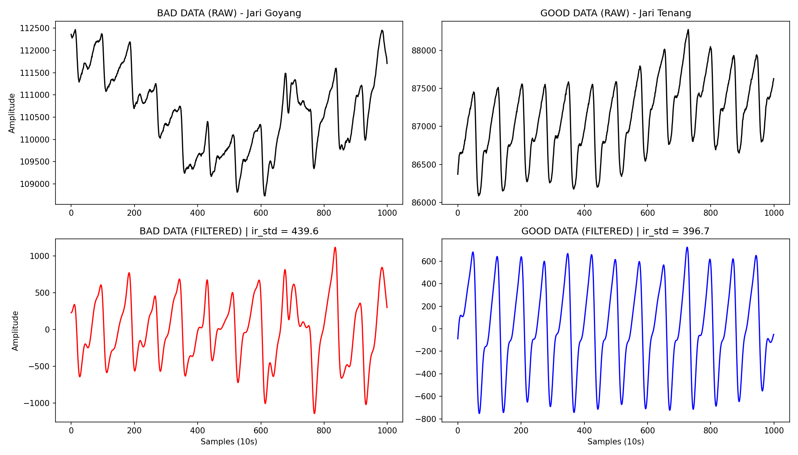

# Dampak Fatal Data Cacat Terhadap Ekstraksi Fitur

Sesuai permintaanmu, saya baru saja "menangkap" satu data pasien yang goyang parah (memiliki Time CV & Amp CV yang sangat buruk) lalu menyandingkannya dengan data pasien yang diam dengan tenang. 

Kedua pasien ini sama-sama menderita **Hipertensi (Kelas 1)**.

Mari kita lihat perbedaan bentuk gelombangnya:

### 1. Data Buruk (Kiri) - Ditolak oleh SQA
*   **Asal File:** `raw_data_..._bp132_92.csv`
*   **Time CV:** 27.9% (Sangat Jauh > 15%)
*   **Amp CV:** 28.3% (> 25%)
*   **Analisis Sinyal:** Pada grafik mentah (kiri atas), terlihat ada lonjakan besar di pertengahan rekaman karena jari pasien tergelincir atau menekan terlalu kuat tiba-tiba. 
*   **Dampak Setelah Filter (Kiri Bawah):** Saringan *Bandpass Filter* sudah berjuang keras membuang *noise* pernapasannya, TAPI karena goyangan jarinya terlalu kasar, muncul satu "puncak siluman" yang sangat raksasa di tengah grafik merah.

### 2. Data Baik (Kanan) - Lolos SQA
*   **Asal File:** `raw_data_..._bp139_99.csv`
*   **Time CV:** 2.4% (Sangat stabil)
*   **Amp CV:** 6.2% (Sangat stabil)
*   **Analisis Sinyal:** Jari pasien menempel dengan sangat rileks. Bentuk mentahnya (kanan atas) sangat mulus, dan setelah disaring (kanan bawah), gelombang denyut jantungnya terlihat seragam layaknya detak jam.

---

### Seberapa Fatal Dampaknya Jika SQA Dimatikan?

Inilah bagian yang paling mengejutkan! Mari kita bandingkan nilai akhir **`ir_std` (Standar Deviasi)** yang akan disuapkan ke dalam otak *Random Forest* dari kedua data di atas:

| Parameter | Pasien Hipertensi (Data Baik) | Pasien Hipertensi (Data Buruk) | Rata-rata Orang Normal (Non-Hipertensi) |
| :--- | :--- | :--- | :--- |
| **Nilai `ir_std`** | **396.7** | **439.6** (Membengkak Palsu) | **447.0** |

**Kesimpulan Fatal:**
Jika kamu mematikan SQA, data buruk di atas akan lolos dan tercatat memiliki `ir_std` sebesar **439.6**. 

Padahal, ciri khas fisik pasien Hipertensi sejati adalah pembuluh darahnya kaku, sehingga `ir_std`-nya harusnya mengecil (berada di kisaran **360 - 390**, seperti pada Data Baik). Namun karena ada goyangan jari, nilai `ir_std` pasien Hipertensi tersebut membengkak secara palsu menjadi 439.6!

**Apa akibatnya?**
Angka 439.6 itu sangat mirip dengan angka rata-rata orang **Normal (Non-Hipertensi)** yang pembuluh darahnya elastis (447.0). Otak *Random Forest* akan 100% terkecoh dan salah mendiagnosis pasien Hipertensi tersebut sebagai "Orang Sehat", hanya gara-gara satu kali jarinya tergelincir!

Inilah bukti absolut mengapa filter SQA (Time CV dan Amp CV) adalah gerbang penyelamat nyawa sistemmu!
