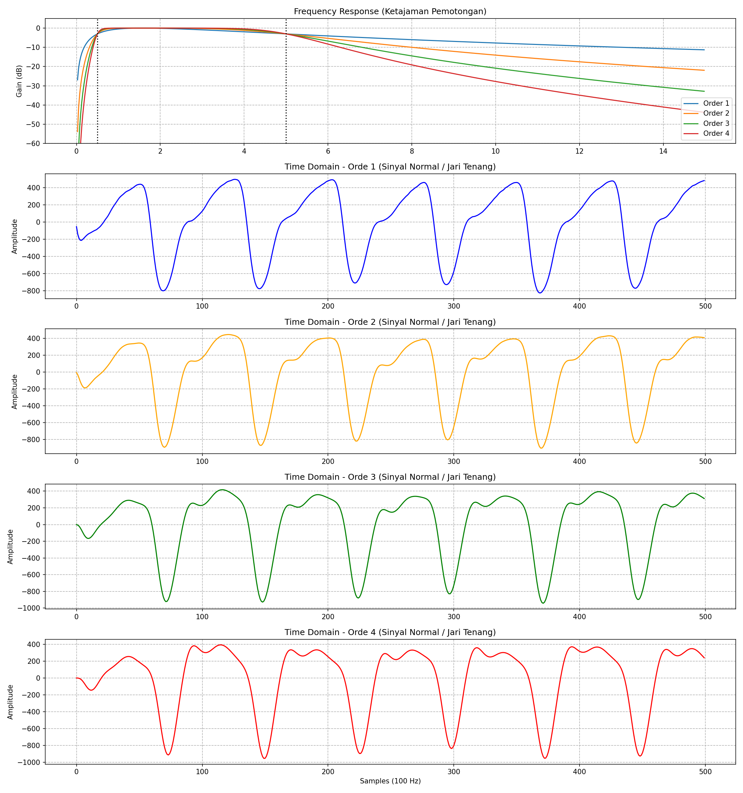
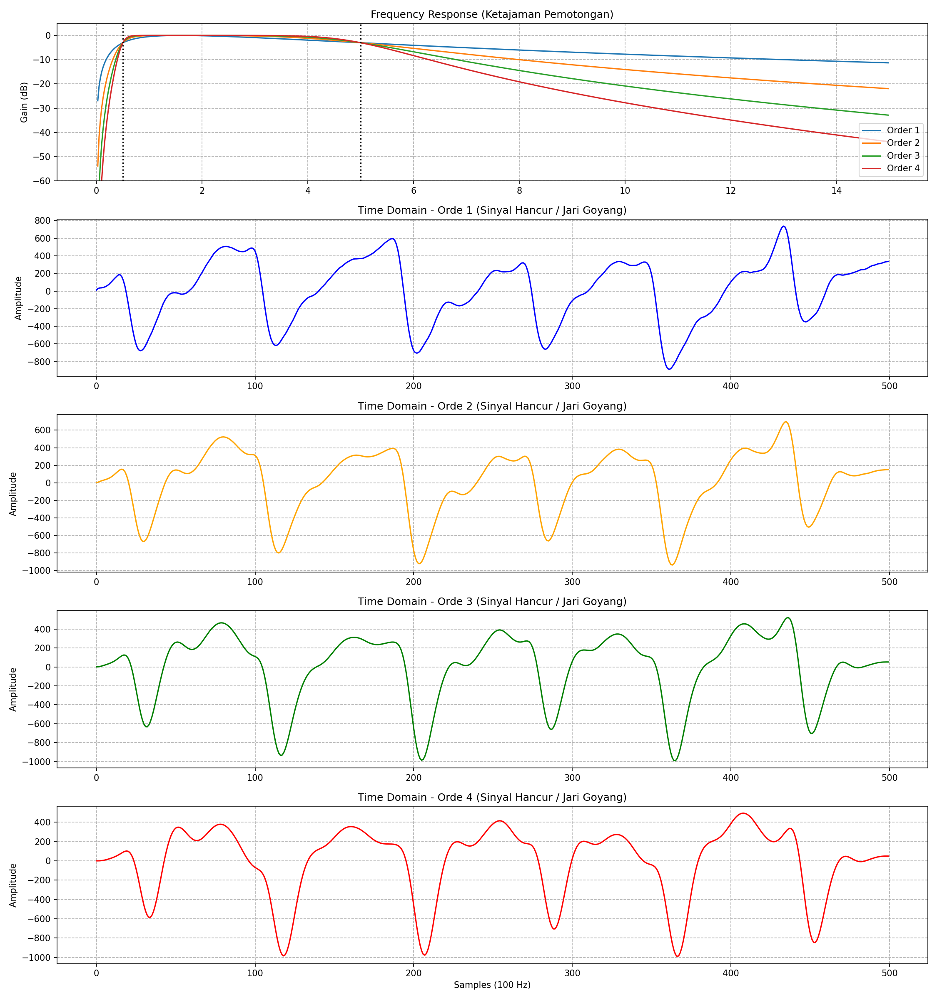

# Analisis Perbandingan Orde Filter (Bandpass)

Berikut adalah visualisasi bukti dari jawaban saya sebelumnya mengenai mengapa kita memilih **Orde 2** sebagai *Sweet Spot*. 

### 1. Grafik Atas (Frequency Response / Bode Plot)
Grafik ini menunjukkan seberapa "tajam" pisau filter kita dalam memotong *noise*. 
Sumbu X adalah Frekuensi (Hz), Sumbu Y adalah kekuatan sinyal (dB). Area di antara dua garis putus-putus hitam (0.5 Hz - 5.0 Hz) adalah area aman (zona jantung berdetak) yang dibiarkan lewat.

*   **Garis Biru (Orde 1):** Terlihat sangat landai bak bukit landai. Ia membiarkan frekuensi *noise* di luar zona aman ikut masuk perlahan-lahan.
*   **Garis Oranye (Orde 2) - Pilihan Kita:** Potongannya cukup tegas dan menukik tajam ke bawah.
*   **Garis Hijau & Merah (Orde 3 & 4):** Memotong dengan sangat ekstrim ke bawah layaknya tebing jurang. Noise benar-benar dibabat habis. 

*Pertanyaan: Jika Orde 4 memotong noise paling bersih, mengapa kita tidak pakai itu saja?*
Jawabannya ada di grafik bawah!

### 2. Grafik Bawah (Time Domain / Bentuk Fisik Gelombang)
Grafik ini adalah efek langsung dari pisau-pisau di atas terhadap data detak jantung aslimu (5 detik pertama).
Perhatikan baik-baik:
*   **Garis Biru (Orde 1):** Bentuknya sangat aneh karena *noise* arus searah (DC) masih belum terpotong bersih, sehingga gelombangnya melayang ke atas dan ke bawah.
*   **Garis Oranye (Orde 2):** Gelombangnya paling rapi, stabil, puncaknya tegas, dan langsung merespon detak pertama dengan cepat.
*   **Garis Hijau & Merah (Orde 3 & 4):** Perhatikan **amplitudo awal-awal di sebelah kiri (sampel 0 - 150)**! Terlihat gelombangnya mengalami **"Ringing"** (getaran buatan/goyangan palsu yang sangat ekstrem akibat pantulan matematis filter tingkat tinggi). Selain itu, semakin tinggi ordenya, puncak gelombangnya semakin tergeser ke kanan (*Phase Delay*).

### Kesimpulan
Jika kamu menggunakan **Orde 4**, memang frekuensi kotornya bersih, TAPI bentuk fisik sinyal jantungmu akan rusak di detik-detik awal akibat *Ringing* (getaran pantulan dari filter), dan posisi puncaknya akan telat bergeser ke kanan. 

**Orde 2** (garis oranye) memberikan pemotongan *noise* yang cukup dalam (grafik atas), TAPI tetap menjaga bentuk fisik gelombang jantungmu tetap asli, stabil, dan minim pergeseran (grafik bawah). Ditambah lagi, komputasi matematikanya paling bersahabat untuk RAM kecil ESP32-mu!

---

## Bagaimana Jika Diterapkan Pada Data Hancur (Jari Goyang)?

Sesuai permintaanmu, mari kita lihat apa yang terjadi jika filter-filter ini kita paksa untuk mengunyah **data yang sangat cacat (goyangan ekstrem)**:

### Analisis Sinyal Hancur (Grafik Bawah):
1.  **Orde 1 (Biru):** Sinyalnya meledak terbang ke atas! Karena Orde 1 potongannya sangat landai, ia sama sekali tidak mampu menahan gelombang frekuensi rendah (DC) akibat goyangan jari.
2.  **Orde 2 (Oranye - Pilihan Kita):** Ia berhasil menahan ledakan goyangan tersebut agar tidak terbang ke luar angkasa, tapi masih membiarkan bentuk cacatnya terlihat. Ini **sangat menguntungkan** karena SQA kita nanti bisa mendeteksinya sebagai anomali dan membuangnya!
3.  **Orde 3 & 4 (Hijau & Merah):** Lihat kekacauan yang terjadi di detik ke-1 hingga detik ke-3 (sampel 100-300)! Karena Orde 4 potongannya terlalu kejam, saat terkena lonjakan goyangan jari yang mendadak, filter ini justru menciptakan puluhan "Riak Pantulan" (*Ringing*) bolak-balik yang sangat ekstrem. Akibatnya, goyangan jari tersebut malah diubah menjadi bentuk gelombang palsu berjejer yang mengacaukan pembacaan amplitudo!

**Kesimpulan Emas:**
Data yang hancur justru membuktikan bahwa Orde 4 terlalu reaktif dan "histeris" saat terkena *noise* kejut (*step response* yang buruk). Sementara **Orde 2** bertindak layaknya peredam kejut (*shock absorber*) yang pas: tidak terlalu lembek, tapi tidak terlalu kaku!
