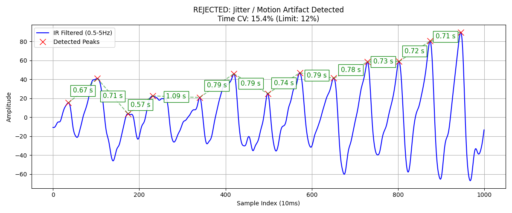

# Visualisasi Data yang Ditolak (Time CV > 12%)

Berikut adalah visualisasi yang **lebih jelas** dari **Gate 1 (Time CV)**, dengan durasi antar puncak yang telah dikonversi langsung menjadi satuan waktu (Detik).

Data ini diambil dari `raw_data_20260502_101327_bp116_83.csv` (Window 1), yang **ditolak karena memiliki Time CV 15.4%** (Batas maksimal 12%).

### Analisis Kenapa Ditolak (Berdasarkan Waktu Jeda):
Perhatikan kotak teks hijau di antara puncak-puncak merah (teks tersebut adalah jeda waktu pasti dari satu detak ke detak berikutnya dalam satuan detik / *seconds*).

1. Awalnya ritme jantung berdetak di sekitar **0.67s** dan **0.71s**.
2. Tiba-tiba, terjadi guncangan sensor! Jeda waktu tiba-tiba menyusut menjadi **0.57s** (muncul puncak prematur yang kecil/cacat).
3. Karena puncak tadi muncul terlalu cepat, jantung butuh waktu lama untuk memompa darah ke puncak berikutnya, sehingga jedanya melar drastis menjadi **1.09s**!
4. Setelah itu ritmenya kembali mencoba stabil di kisaran **0.79s** dan **0.74s**.
5. Lompatan drastis dari **0.57s** langsung ke **1.09s** dalam sedetik inilah yang membuat nilai simpangan baku (Standar Deviasi) meroket.
6. Karena nilai variasinya tembus 15.4%, sistem otomatis menyapu data ini ke tempat sampah.

Visualisasi seperti ini (beserta satuan waktu yang presisi) akan sangat memanjakan mata dosen pengujimu saat kamu mempresentasikan proses *Data Cleaning* di sidang nanti!
